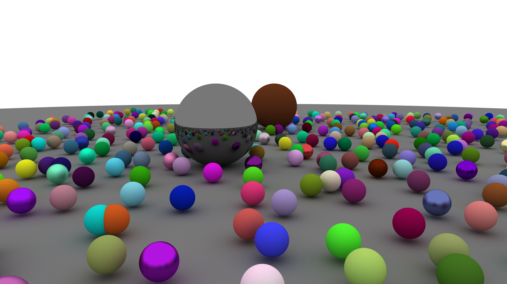

Too Many Ray Tracers!
==

Yet another ray tracer on the Internet...

This one is written in Rust, and is based on [Ray Tracing in One Weekend](https://raytracing.github.io/books/RayTracingInOneWeekend.html).
